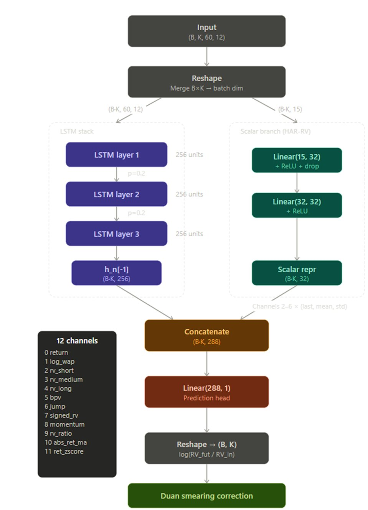

# LSTM Input Channels (12 per time step)

- **return** — clipped log-return between consecutive WAP values, bounded to ±0.05
- **log_wap** — log ratio of WAP to the opening price, capturing intraday drift
- **rv_short** — realized volatility over a 5-step rolling window (√Σret²)
- **rv_medium** — realized volatility over a 20-step rolling window
- **rv_long** — realized volatility over a 50-step rolling window
- **bpv** — bipower variation (5-step), a jump-robust volatility estimator using consecutive absolute returns scaled by π/2
- **jump** — difference between short-window squared returns and bpv (floored at 0), isolating the jump component of volatility
- **signed_rv** — ret × |ret|, a direction-aware quadratic variation that preserves the sign of large moves
- **momentum** — 10-step cumulative return, capturing short-term trend
- **rv_ratio** — rv_short / rv_long, a vol-of-vol proxy indicating whether short-term volatility is elevated relative to the longer trend
- **abs_ret_ma** — 5-step rolling mean of |ret|, a smoothed absolute return measure
- **ret_zscore** — return standardized over a 20-step rolling window ((ret − μ̂) / σ̂), flagging unusually large moves

# Scalar Branch Features (15 per cluster)

For each of channels 2–6 (rv_short, rv_medium, rv_long, bpv, jump), three summary statistics are extracted across the 60-step input window:

- Last value
- Mean
- Standard deviation

This gives 5 channels × 3 stats = 15 scalar features per cluster, fed to the HAR-RV MLP correction path.

# Stock Profiling Features (5 per stock, used for clustering only)

These are computed over training data to group stocks via K-Means — they don't enter the model as inputs:

- Realized volatility
- Mean return
- Skewness
- Kurtosis
- Maximum drawdown

---

# Model Architecture

## Input

- Shape: `(B, K, 60, 12)` — batch size B, K stocks per cluster, 60 time steps, 12 channels
- **Reshape**: merge B×K → batch dim

This produces two branches:

- LSTM stack input: `(B·K, 60, 12)`
- Scalar branch input: `(B·K, 15)`

## LSTM Stack

| Layer | Units | Dropout |
|-------|-------|---------|
| LSTM layer 1 | 256 | p=0.2 |
| LSTM layer 2 | 256 | p=0.2 |
| LSTM layer 3 | 256 | — |

Output: `h_n[-1]` — final hidden state of the last layer, shape `(B·K, 256)`

## Scalar Branch (HAR-RV)

Channels 2–6 × (last, mean, std) → 15 scalar features per sample.

| Layer | Details |
|-------|---------|
| Linear(15, 32) | + ReLU + dropout |
| Linear(32, 32) | + ReLU |

Output: scalar representation, shape `(B·K, 32)`

## Concatenation & Prediction

1. **Concatenate** LSTM output and scalar repr → `(B·K, 288)`
2. **Linear(288, 1)** — prediction head
3. **Reshape** → `(B, K)` — output is `log(RV_fut / RV_in)`
4. **Duan smearing correction** — bias adjustment for log-scale predictions
